# mybot

This is a test messenger bot app build with Python - Flask library. It connects to a facebook page via a token and respose to messages sent by clients to the facebook page.

## Setup Requirements

- Python 3.6 or higher
- Flask
- pymessanger
- ptyhon-dotenv
- [ngrok](https://ngrok.com/download)

## Environment Setup

### Install Libraries
- Install python libraries to run project
```
pip3 install -r requirements.txt
```
- Download [ngrok](https://ngrok.com/download)
- Login to ngrok from your browser.
- Follow instructions [here](https://dashboard.ngrok.com/get-started/setup) to connect to your account from your local machine.

### Facebook App Setup
- Login/Register to [Facebook Developers](https://developers.facebook.com/) site
- Create a new app
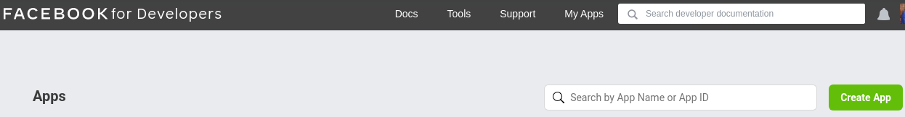
- Select Business app type then Click *Continue*
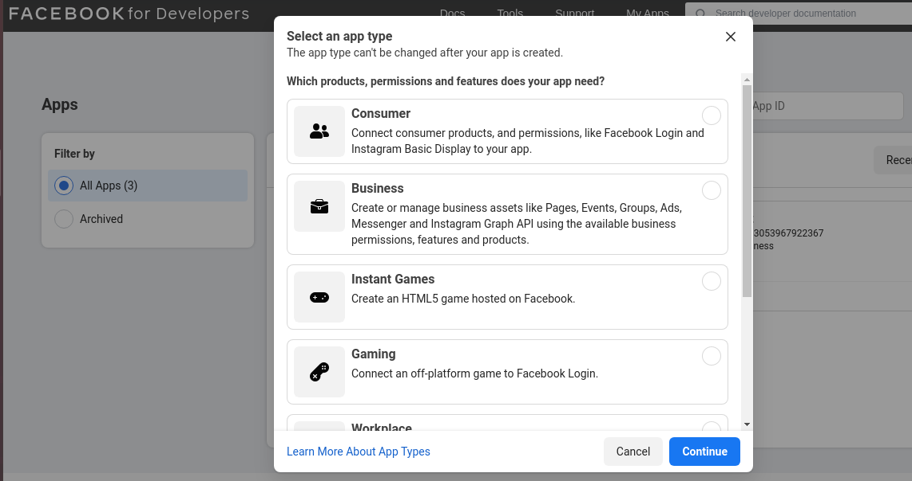
- Enter app name and Contact email Then click *Create APP*
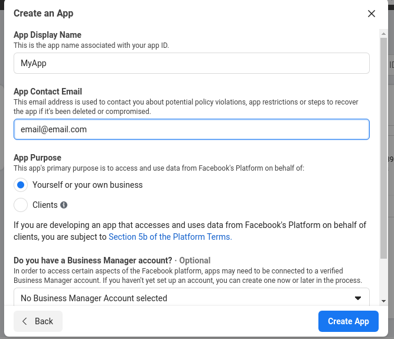
- Select the Product *Messenger* and Click *SetUp*
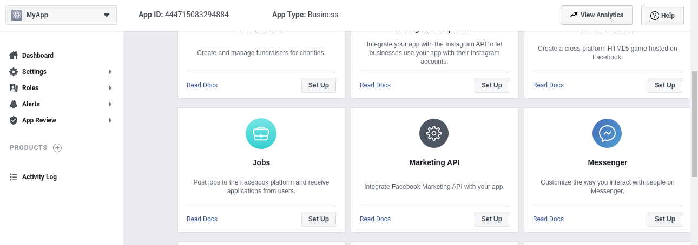
- Create new facebook page or Add an Existing Page where you will use the bot.
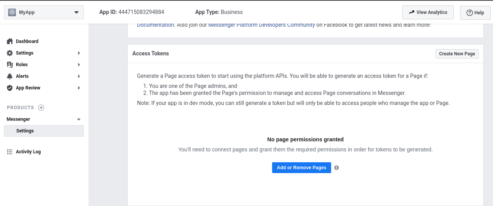
- Generate an Access Token for the page. Copy and keep this token secrete and do not share with any one.
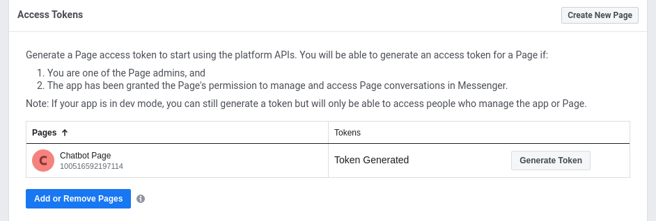

## Running the App
- We would clone this repo
- Navigate to the project root folder
- create a *.env* file with fields
    - -> VERIFIER_JETON=`"add any verificatio message here"`
    - -> PAGE_ACCESS_TOKEN=`"add the token generated from facebook here"`

- Now run the flask app
```
FLASK_APP=mybot.py flask run
```
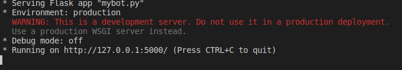
- Navigate to where you downloaded the *ngrok* application and run ngrok.
```
./ngrock http 5000
```
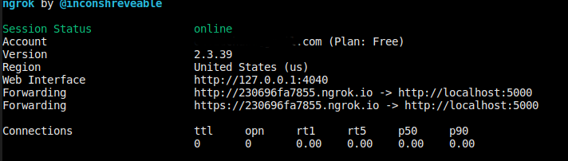
- Copy the Fowarding url with https
```
https://230696fa7855.ngrok.io
```
- Go back to your facebook app settings and Edit the Webhook
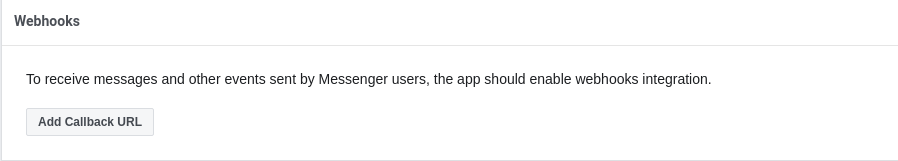
- Insert the url you coppied adding `/webhook` to hit the webhook endpoint served by the app
```
https://230696fa7855.ngrok.io/webhook
```
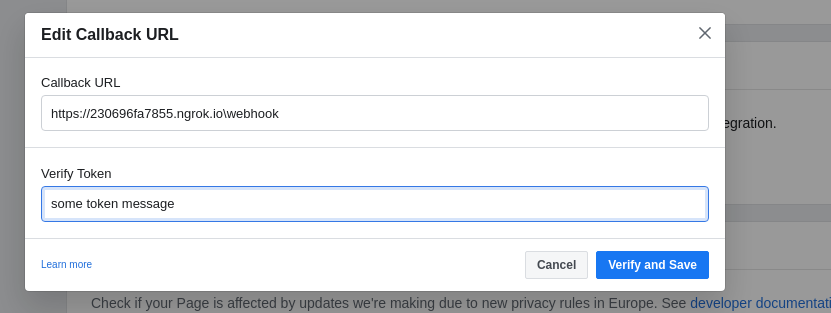
- Save the configurations. The webhook config page should close without errors.
- You should see a message from your flask app terminal showing your conncetion was successfull.
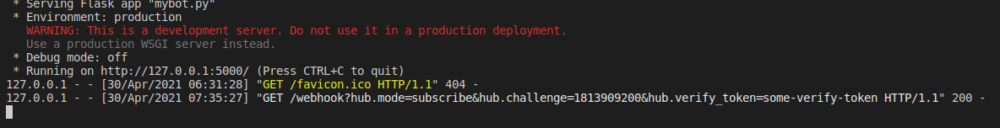
- Now send a message to your faceboog page and it should respond to you directly.
